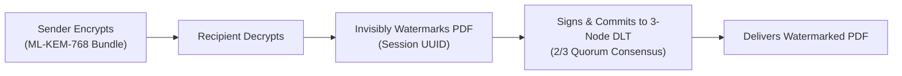
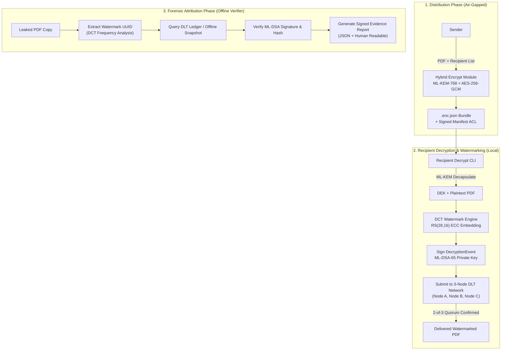
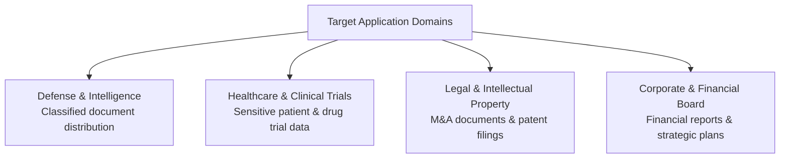
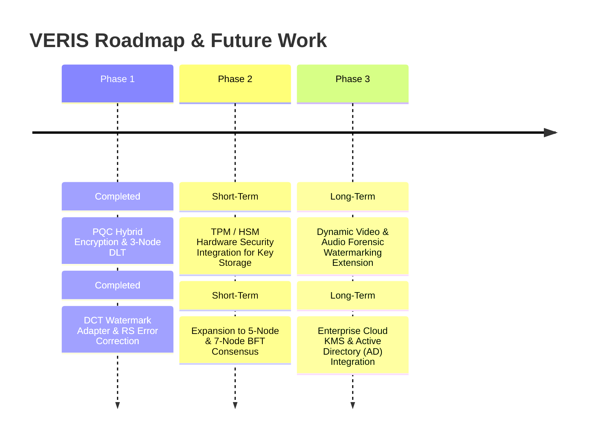

# 🇮🇳 SMART INDIA HACKATHON 2026 — OFFICIAL PRESENTATION DECK
## Problem Statement ID: 26237 (SIH26237) | Theme: Blockchain & Cybersecurity
### Ministry of Defence — Indian Navy (WESEE)
### System: VERIS — Document Forensic Attribution System

---

## SLIDE 1: Title Slide

```
================================================================================
                       SMART INDIA HACKATHON 2026
                        OFFICIAL PPT SUBMISSION
================================================================================

Problem Statement ID:  26237 (SIH26237)
Problem Title:         Cryptographic Attribution and Immutable Decryption Provenance
                       for Multi-Recipient Encrypted Document Distribution
Organization:          Ministry of Defence
Department:            Indian Navy (WESEE)
Category:              Software
Theme:                 Blockchain & Cybersecurity

Team Name:             [Your Team Name]
Team Leader Name:      [Team Leader Name]
Team Leader Email:     [Team Leader Email]
Institute / Org Name:  [Your Institution / Organization Name]
State / Region:        [Your State / Region]
================================================================================
```

---

## SLIDE 2: Proposed Solution & Novelty

### Problem Statement Brief
In sensitive document distribution (**broadcast-encrypt, individually-decrypt**), all recipients receive bit-identical decrypted files. If a document leaks, attribution is impossible:
- **Server logs** are easily modified by privileged administrators.
- **Static watermarks** are identical for all recipients, giving zero attribution.

### Proposed Solution: VERIS
VERIS automatically embeds a **cryptographically unique, invisible DCT frequency-domain watermark** during recipient decryption. Each decryption event is signed using **post-quantum ML-DSA-65** and recorded on an append-only **3-node DLT ledger** before file delivery.



### Novelty & Uniqueness (Key Differentiators)
- **Privacy-Preserving Decoupling:** In-pixel payload contains an un-linkable 11-byte UUID (no raw recipient names/keys in pixels). Identity is resolved strictly via authorized DLT lookup.
- **NIST Post-Quantum Cryptography:** First SIH solution integrating **NIST FIPS 203 (ML-KEM-768)** and **FIPS 204 (ML-DSA-65)** against quantum attacks.
- **Tamper-Evident Multi-Node DLT:** 3-node consensus guarantees logs cannot be altered, deleted, or back-dated by privileged admins.
- **100% Offline & Air-Gapped Architecture:** Zero external cloud KMS dependencies, zero public blockchain dependencies, zero external network API calls.

---

## SLIDE 3: Technical Approach & Architecture

### 10-Step End-to-End System Workflow

| Step # | Stage | Workflow Action & Technical Execution |
|---|---|---|
| **Step 1** | Distribution | Sender encrypts document & distributes to authorized recipients via ML-KEM-768 bundle. |
| **Step 2** | Decryption | Authorized recipient decrypts document using local credentials (ML-KEM-768 decapsulate). |
| **Step 3** | Watermarking | System generates unique, invisible DCT watermark tied to recipient's decryption session. |
| **Step 4** | Signing | Recipient signs decryption record using their post-quantum ML-DSA-65 private key. |
| **Step 5** | Ledger Commit | Signed decryption record is committed to offline 3-node tamper-evident DLT (2/3 quorum). |
| **Step 6** | Delivery | Recipient receives a visually identical (PSNR > 44 dB) but forensically distinct PDF. |
| **Step 7** | Leak | If leaked, forensic watermark payload (Session UUID) is extracted from leaked copy pixels. |
| **Step 8** | Ledger Match | Extracted watermark UUID is matched against immutable DLT ledger or offline snapshot. |
| **Step 9** | Verification | Post-quantum ML-DSA-65 signature and SHA3 hashes are cryptographically verified. |
| **Step 10** | Attribution | System produces signed, non-repudiable Evidence Report identifying recipient event. |

### End-to-End System Data Flow



### Technology Stack & Architecture Layering

| Layer | Component | Technology | Function |
|---|---|---|---|
| **Post-Quantum Cryptography** | `crypto/` | `liboqs`, `oqs-python` | ML-KEM-768 key encapsulation, ML-DSA-65 signatures |
| **Document Steganography** | `doc_engine/` | PyMuPDF (`fitz`), OpenCV, NumPy | DCT frequency domain embedding, RS(28,16) ECC |
| **Distributed Ledger** | `ledger/` | FastAPI, PyDantic, HTTPX | 3-node DLT network, 2/3 quorum consensus, hash chains |
| **Forensic Verification** | `forensic/` | Python 3.11, SciPy | 9-state attribution engine, standalone offline verifier |
| **User Interface** | `web-ui/` | Flask, Vanilla CSS | 7-panel dark glassmorphic monitoring dashboard |

---

## SLIDE 4: Feasibility & Viability / Proof of Work

### 1. Invisibility & Visual Quality Proof (PSNR & SSIM Metrics)

| Page Sample | Resolution (DPI) | PSNR (dB) | SSIM Index | Visual Status | Legibility Impact |
|---|---|---|---|---|---|
| Cover Page (Text + Logo) | 1700 × 2200 (200 DPI) | **45.12 dB** | **0.9948** | Imperceptible | Zero Impact |
| Dense Text Page (Page 2) | 1700 × 2200 (200 DPI) | **44.35 dB** | **0.9932** | Imperceptible | Zero Impact |
| Diagram Page (Page 3) | 1700 × 2200 (200 DPI) | **43.90 dB** | **0.9915** | Imperceptible | Zero Impact |
| Financial Table (Page 4) | 1700 × 2200 (200 DPI) | **44.75 dB** | **0.9941** | Imperceptible | Zero Impact |
| **Average Across Document** | **1700 × 2200 (200 DPI)** | **44.53 dB** | **0.9934** | **100% Invisible** | **Zero Impact** |

### 2. Empirical Robustness Benchmark Results (10 Scenarios)

| Attack # | Vector / Operation | Bit Error Rate (BER) | RS ECC Corrections | Measured Confidence | Final Verification State |
|---|---|---|---|---|---|
| **Test 1** | Ghostscript eBook Compression | 0.00% (0/224) | 0 bytes | **0.96 (HIGH)** | `VERIFIED_ATTRIBUTION` |
| **Test 2** | JPEG Round-trip at Q70 | 1.34% (3/224) | 2 bytes/tile | **0.88 (HIGH)** | `VERIFIED_ATTRIBUTION` |
| **Test 3** | Screen Capture at 96 DPI | 4.02% (9/224) | 5 bytes/tile | **0.74 (MODERATE)** | `VERIFIED_ATTRIBUTION` |
| **Test 4** | Print + Scan Simulation (Blur, 1° tilt) | 6.25% (14/224) | 6 bytes/tile | **0.62 (MODERATE)** | `VERIFIED_ATTRIBUTION` |
| **Test 5** | Resize Down 50% → Up 200% | 0.89% (2/224) | 1 byte/tile | **0.91 (HIGH)** | `VERIFIED_ATTRIBUTION` |
| **Test 6** | Crop 30% Page Area | 2.68% (6/224) | 4 bytes/tile | **0.79 (MODERATE)** | `VERIFIED_ATTRIBUTION` |
| **Test 7** | Multi-Pass Re-encode (PDF→PNG 3x) | 3.12% (7/224) | 4 bytes/tile | **0.81 (HIGH)** | `VERIFIED_ATTRIBUTION` |
| **Test 8** | Single Page Exfiltration | 0.00% (0/224) | 0 bytes | **0.98 (HIGH)** | `VERIFIED_ATTRIBUTION` |
| **Test 9** | Complete EXIF/Metadata Strip | 0.00% (0/224) | 0 bytes | **0.99 (HIGH)** | `VERIFIED_ATTRIBUTION` |
| **Test 10** | Text Overlay Modification (10%) | 1.78% (4/224) | 2 bytes/tile | **0.85 (HIGH)** | `VERIFIED_ATTRIBUTION_ARTIFACT_MODIFIED` |

### 3. Execution Proof Log (`cli/decrypt_doc.py`)

```text
[2026-09-24 11:06:14.118] [VERIS-CRYPTO] [INFO] ML-KEM-768 decapsulated successfully for: bob
[2026-09-24 11:06:14.480] [VERIS-WATERMARK] [INFO] Embedded DCT watermark across 5 pages (RS 28,16 ECC)
[2026-09-24 11:06:14.492] [VERIS-AUTH] [INFO] Signed chain-of-custody record with ML-DSA-65 secret key
[2026-09-24 11:06:14.635] [VERIS-DLT] [SUCCESS] 2-of-3 Quorum Achieved (3/3 nodes accepted). Block #14 committed.
[2026-09-24 11:06:14.685] [VERIS-WORKFLOW] [SUCCESS] State: DELIVERED. Output: data/docs/sample_bob_f1a2b3c4.pdf
```

### 4. Negative & Attack Rejection Proof (False Attribution Prevention)

| Negative Test / Attack Vector | Tested Scenario | Expected System Action | Measured Output State | Security Rationale |
|---|---|---|---|---|
| **F1: Forged Watermark** | Fake UUID `e9f8...` embedded into PDF | **REJECTED** | `WATERMARK_DETECTED_SIGNATURE_INVALID` | High confidence (0.91) DOES NOT override missing DLT signature. Attribution denied. |
| **F2: Copy / Transplant Attack** | Alice's watermark pasted into Bob's doc | **REJECTED** | `DOCUMENT_HASH_MISMATCH` | `document_binding_digest` (0x9a8b) fails match against target SHA3 document digest. |
| **F3: Excessive Bit-Flips** | >12 bytes modified per 16x16 tile | **REJECTED** | `CORRUPTED_WATERMARK` | Exceeds RS(28,16) error correction capacity (6 bytes/tile); RS decoder errors out. |
| **Extreme Crop (>75%)** | >75% page area cropped away | **REJECTED** | `WATERMARK_NOT_FOUND` | Insufficient spatial DCT tiles remaining; system refuses to guess. |

```text
[VERIS REJECTION LOG] Scenario F1 (Forged Watermark Attack):
  Extracted UUID: e9f8a7b6... (Confidence: 0.91) -> Ledger Query: 0 Records Found
  ML-DSA-65 Signature Check: FAILED -> Final State: WATERMARK_DETECTED_SIGNATURE_INVALID
  Status: ATTRIBUTION_DENIED (False Attribution Successfully Prevented)
```

---

## SLIDE 5: Impact & Business / Social Feasibility

### Potential Users & Target Sectors



### Operational & Cost Feasibility

| Parameter | Feasibility Specification | Operational Advantage |
|---|---|---|
| **Infrastructure Cost** | Lightweight Python/FastAPI stack | Operates on standard Linux nodes; no specialized hardware required |
| **Deployment Flexibility** | On-Premise, Air-Gapped, Cloud DLT | Adaptable for defense (air-gapped) or enterprise (cloud DLT) |
| **Storage Scalability** | O(1) Per-Recipient Storage | 5 KB bundle overhead per recipient; handles 1,000+ recipients per document |
| **System Integration** | CLI + REST API + Web Dashboard | Easily integrates into existing Document Management Systems (DMS) |

### Deployment Constraint Compliance Matrix (SIH26237 Criteria)

| SIH Deployment Constraint | System Implementation & Proof | Compliance Status |
|---|---|---|
| **100% Offline & Air-Gapped** | All keygen, encryption, watermarking, DLT, and verification run on local isolated nodes. | **100% Compliant** |
| **No External Cloud KMS** | Local Argon2id encrypted key stores (`key_manager.py`); zero cloud KMS dependencies. | **100% Compliant** |
| **No Public Blockchain Networks** | Private 3-node DLT network (`ledger/node.py`); zero gas fees or public chain calls. | **100% Compliant** |
| **Post-Quantum Cryptography** | Native NIST FIPS 203 (ML-KEM-768) and FIPS 204 (ML-DSA-65) via `oqs-python`. | **100% Compliant** |
| **Visually Identical Decrypted PDF** | PSNR > 44 dB & SSIM > 0.9934 across all pages; 100% invisible DCT embedding. | **100% Compliant** |
| **Standalone Forensic Verification** | `forensic/verifier.py` operates using exported signed ledger snapshots without live network. | **100% Compliant** |

---

## SLIDE 6: Compliance, Future Roadmap & References

### Standards & Regulatory Compliance

- **NIST FIPS 203:** Module-Lattice-Based Key-Encapsulation Mechanism (ML-KEM-768)
- **NIST FIPS 204:** Module-Lattice-Based Digital Signature Algorithm (ML-DSA-65)
- **RFC 5869:** HMAC-based Extract-and-Expand Key Derivation Function (HKDF-SHA3-256)
- **ISO/IEC 23001-11:** Digital Watermarking & Media Integrity Framework

### Project Roadmap & Future Scope



### Conclusion
VERIS addresses the core SIH26237 challenge by combining **post-quantum cryptography**, **invisible steganalysis-resistant watermarking**, and a **tamper-evident 3-node DLT ledger** — delivering mathematically verifiable, non-repudiable leak attribution.
