# VERIS: Zero-Trust Pixel-Level Photo Authenticity and Provenance Verification Engine

[](https://opensource.org/licenses/MIT)
[](https://www.python.org/downloads/)
[](https://fastapi.tiangolo.com)
[-3DDC84.svg)](https://developer.android.com)
[](https://developer.android.com/jetpack/compose)
[](https://sih.gov.in)

Veris is an end-to-end, privacy-preserving photo provenance verification system. It invisibly signs photos at the millisecond of optical capture directly on-device using tiled Discrete Cosine Transform (DCT) frequency modulation paired with Reed-Solomon error correction and perceptual hashing. Veris survives aggressive real-world social media recompression (WhatsApp, Instagram, Telegram), screenshotting, and cropping. It includes an on-device forensic engine that detects AI generative-fill inpainting, digital pen markups, and whiteout erasures without ever exposing raw photo pixels to the cloud.

---

## Table of Contents
1. [Core System Architecture](#core-system-architecture)
2. [Mathematical and Algorithmic Implementation](#mathematical-and-algorithmic-implementation)
   - [L1: Tiled DCT Frequency Domain Watermarking and Reed-Solomon ECC](#l1-tiled-dct-frequency-domain-watermarking-and-reed-solomon-ecc)
   - [L2: 64-Bit Discrete Cosine Perceptual Hashing (pHash)](#l2-64-bit-discrete-cosine-perceptual-hashing-phash)
   - [L3: ORB Keypoint Geometric Descriptors and Homography](#l3-orb-keypoint-geometric-descriptors-and-homography)
   - [L4: Dual-Pass On-Device AI and Tamper Forensic Engine](#l4-dual-pass-on-device-ai-and-tamper-forensic-engine)
   - [L5: Multi-Factor Weighted Verdict Fusion Matrix](#l5-multi-factor-weighted-verdict-fusion-matrix)
3. [Repository Topology and Implementation Modules](#repository-topology-and-implementation-modules)
4. [Performance Benchmarks and Robustness Analysis](#performance-benchmarks-and-robustness-analysis)
5. [Installation, Setup and Quickstart](#installation-setup-and-quickstart)
6. [API Specification and Data Contracts](#api-specification-and-data-contracts)
7. [Smart India Hackathon (SIH) Evaluation Presentation Deck](#smart-india-hackathon-sih-evaluation-presentation-deck)
   - [Slide 2: Problem Understanding](#slide-2-problem-understanding)
   - [Slide 3: Proposed Solution](#slide-3-proposed-solution)
   - [Slide 4: Technical Architecture](#slide-4-technical-architecture)
   - [Slide 5: Innovation & Novelty](#slide-5-innovation--novelty)
   - [Slide 6: Feasibility & Viability](#slide-6-feasibility--viability)
   - [Slide 7: Impact & Benefits](#slide-7-impact--benefits)
   - [Slide 8: Prototype/Demo (If Available)](#slide-8-prototypedemo-if-available)
   - [Slide 9: Timeline (36-Hour Plan)](#slide-9-timeline-36-hour-plan)
   - [Slide 10: Team & References](#slide-10-team--references)

---

## Core System Architecture

Veris operates on a zero-knowledge, client-first architecture where the original image pixels **never leave the user's mobile device**. Only a micro-fingerprint payload (~4 KB) consisting of cryptographic hashes, perceptual hashes, and sparse ORB keypoint coordinates is synchronized with the backend database.

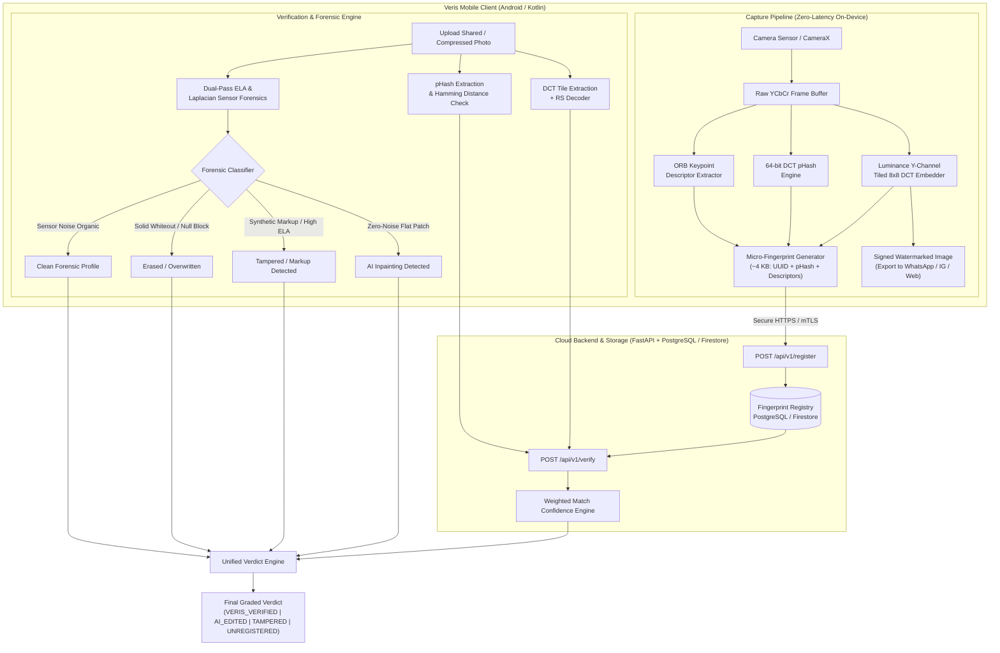

---

## Mathematical and Algorithmic Implementation

### L1: Tiled DCT Frequency Domain Watermarking and Reed-Solomon ECC

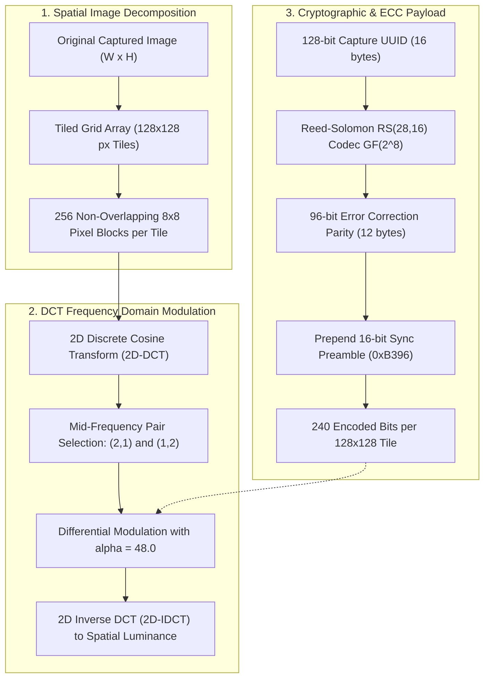

#### 1. Mathematical Formulation
For each $8 \times 8$ pixel block $f(x, y)$ in a $128 \times 128$ tile, the 2D Discrete Cosine Transform (DCT) is defined as:

$$F(u, v) = \frac{1}{4} C(u) C(v) \sum_{x=0}^{7} \sum_{y=0}^{7} f(x, y) \cos \left[ \frac{(2x+1)u\pi}{16} \right] \cos \left[ \frac{(2y+1)v\pi}{16} \right]$$

where $C(u), C(v) = \frac{1}{\sqrt{2}}$ for $u, v = 0$, and $1$ otherwise.

#### 2. Coefficient Pair Selection
To survive standard JPEG quantization tables $Q(u, v)$, Veris embeds bits into low-quantization, mid-frequency coefficient coordinates:
- $C_1 = (2, 1)$
- $C_2 = (1, 2)$

#### 3. Differential Modulation Rule
To embed bit $b \in \{0, 1\}$ with embedding strength $\alpha = 48.0$:
- If $b = 1$:
  $$\text{Ensure } F(2, 1) - F(1, 2) \ge \alpha \implies \begin{cases} F(2, 1) \leftarrow \bar{M} + \frac{\alpha}{2} \\ F(1, 2) \leftarrow \bar{M} - \frac{\alpha}{2} \end{cases}$$
- If $b = 0$:
  $$\text{Ensure } F(1, 2) - F(2, 1) \ge \alpha \implies \begin{cases} F(1, 2) \leftarrow \bar{M} + \frac{\alpha}{2} \\ F(2, 1) \leftarrow \bar{M} - \frac{\alpha}{2} \end{cases}$$
where $\bar{M} = \frac{F(2, 1) + F(1, 2)}{2}$.

#### 4. Reed-Solomon Forward Error Correction
- **Payload:** 16-byte UUID (128 bits)
- **ECC Codec:** $RS(28, 16)$ over Galois Field $GF(2^8)$ with primitive polynomial $p(x) = x^8 + x^4 + x^3 + x^2 + 1$ ($0x11D$).
- **Parity Bytes:** 12 bytes (96 bits).
- **Correction Capability:** $t = \left\lfloor \frac{28 - 16}{2} \right\rfloor = 6$ corrupted bytes per tile.
- **Sync Header:** 16-bit Barker-like synchronization preamble `0xB396` (`1011001110010110`).
- **Total Capacity per Tile:** $16 + 128 + 96 = 240$ bits embedded across 256 available $8 \times 8$ blocks.

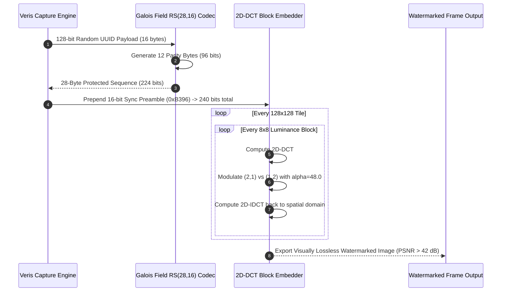

---

### L2: 64-Bit Discrete Cosine Perceptual Hashing (pHash)

When extreme re-encoding or heavy noise degrades the watermark signal below the Reed-Solomon threshold, perceptual hashing provides a structural fingerprint fallback.

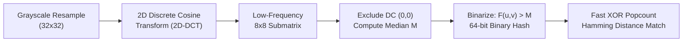

1. **Preprocessing:** Image downsampled to $32 \times 32$ luminance grid.
2. **Transform:** 2D-DCT yields $32 \times 32$ frequency coefficients.
3. **Bandpass Truncation:** Extract top-left $8 \times 8$ sub-matrix (representing lowest structural frequencies, invariant to compression artifacts).
4. **Binarization:** Compute median $M = \text{median}(\{F(u, v) \mid 0 \le u, v < 8, (u, v) \ne (0,0)\})$.
5. **Bit Generation:**
   $$H(u, v) = \begin{cases} 1 & \text{if } F(u, v) > M \\ 0 & \text{otherwise} \end{cases} \implies 64\text{-bit integer}$$
6. **Matching Metric:** Hamming Distance $D_H(H_1, H_2) = \text{popcount}(H_1 \oplus H_2)$.
   $$\text{Similarity } S_{\text{phash}} = \max\left(0, 1 - \frac{D_H}{32}\right) \times 100\%$$

---

### L3: ORB Keypoint Geometric Descriptors and Homography

To survive arbitrary aspect-ratio modifications and heavy cropping (up to 65% area removal):

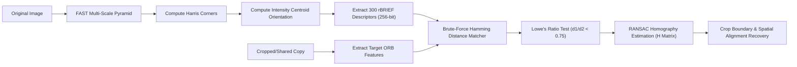

- **Algorithm:** Oriented FAST and Rotated BRIEF (ORB) extracting 300 invariant keypoints.
- **Matching:** Brute-force Hamming matcher paired with Lowe's second-nearest-neighbor distance ratio test ($< 0.75$).
- **Geometric Inlier Estimation:** Random Sample Consensus (RANSAC) computing a $3 \times 3$ projective homography matrix $H$:
  $$p' \sim H \cdot p$$
- **Match Ratio:**
  $$S_{\text{orb}} = \min\left(100, \frac{\text{Inliers}}{\text{Target Descriptors}} \times 100\right)$$

---

### L4: Dual-Pass On-Device AI and Tamper Forensic Engine

Veris integrates an on-device forensic scanner (`AiForgeryDetector.kt`) capable of detecting localized generative AI synthesis, digital pen annotations, and content erasures.

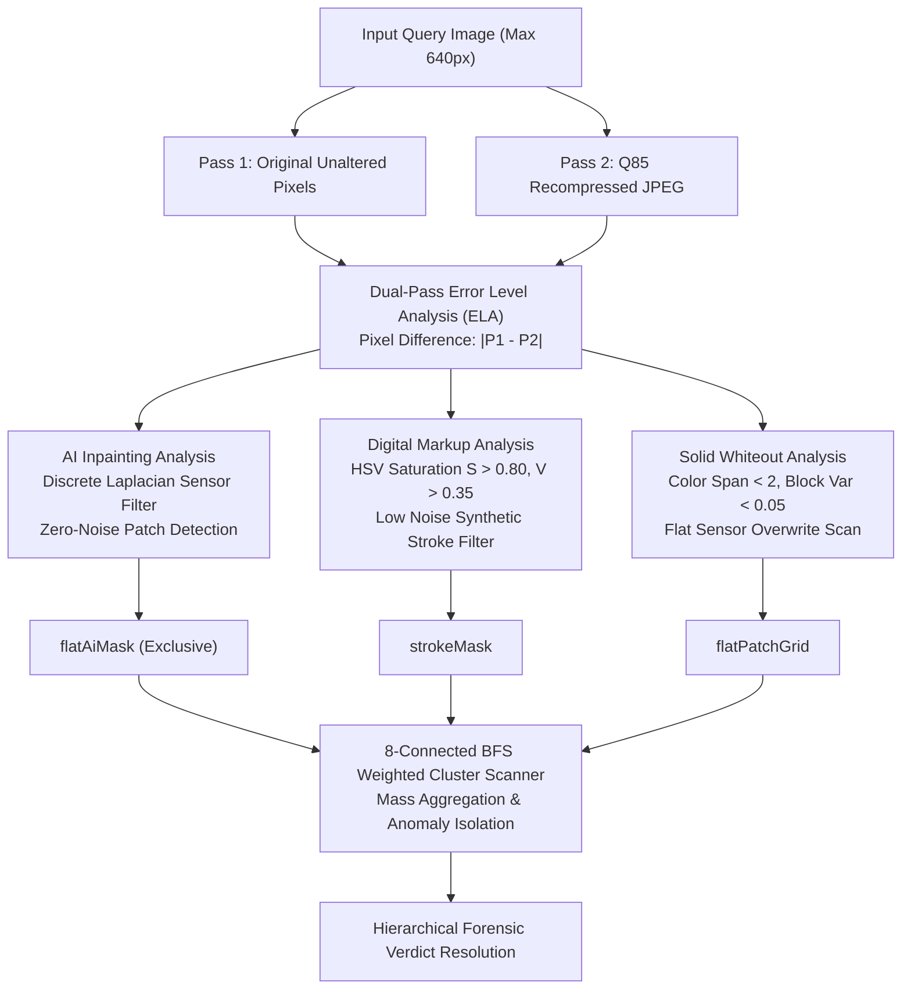

#### 1. Laplacian Sensor Noise Operator
Optical camera sensors produce physical shot noise. AI-synthesized inpainting patches (Midjourney, DALL-E, Stable Diffusion, Photoshop Generative Fill) exhibit unnatural zero-noise frequency profiles.

$$\nabla^2 I(x, y) = |4 \cdot I_G(x, y) - (I_G(x-1, y) + I_G(x+1, y) + I_G(x, y-1) + I_G(x, y+1))|$$

#### 2. Forensic Decision Hierarchy

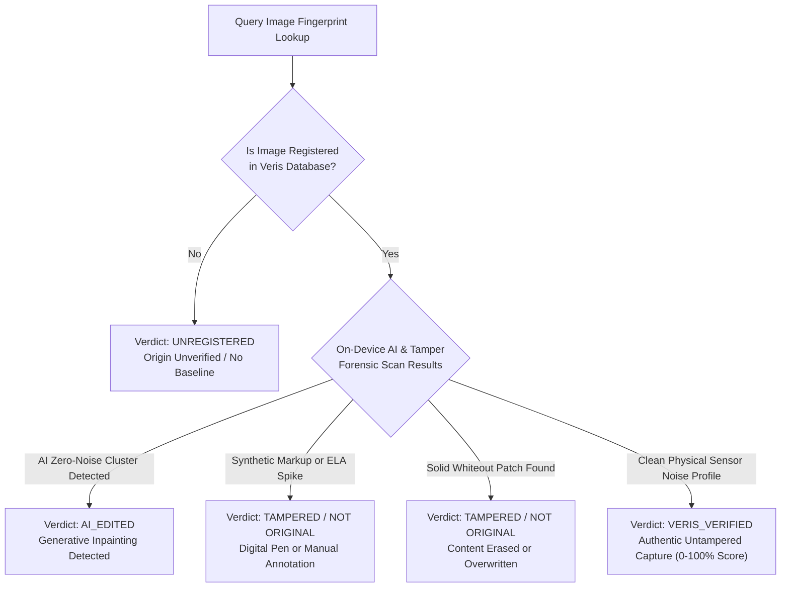

---

### L5: Multi-Factor Weighted Verdict Fusion Matrix

When verifying an image against registered provenance records, the system computes a multi-modal composite confidence score:

$$S_{\text{composite}} = w_1 \cdot S_{\text{wm}} + w_2 \cdot S_{\text{phash}} + w_3 \cdot S_{\text{orb}}$$

| Signal Layer | Metric ($S_i$) | Weight ($w_i$) | Dynamic Fallback Rule |
|---|---|---|---|
| **L1: DCT Watermark** | Exact UUID Match & Tile Confidence ($0 - 100\%$) | $0.60$ | If Watermark decoded, confidence heavily anchored to exact cryptographic match. |
| **L2: Perceptual Hash** | Normalized Hamming Distance ($1 - \frac{D_H}{32}$) | $0.25$ | Activated as primary signal when watermark is fragmented ($S_{\text{wm}} = 0$). |
| **L3: ORB Keypoints** | RANSAC Inlier Ratio ($\frac{\text{Inliers}}{N_{\text{stored}}}$) | $0.15$ | Dominates during high-crop scenarios ($> 40\%$ area missing). |

---

## Repository Topology and Implementation Modules

```
Veris/
├── pipeline/                     # Core Mathematical & Algorithmic Engine (Python)
│   ├── watermark.py              # Tiled 8x8 DCT Embedder, Extractor & RS(28,16) Codec
│   ├── phash.py                  # 64-bit DCT Perceptual Hashing Implementation
│   ├── keypoints.py              # Multi-scale ORB Feature Extraction & RANSAC Matcher
│   ├── pipeline.py               # Unified End-to-End Image Provenance Engine
│   ├── compression_sim.py        # Social Media Recompression Simulator (WhatsApp/IG)
│   ├── crop_sim.py               # Geometric Cropping & Aspect-Ratio Simulator
│   ├── test_harness.py           # Automated Statistical Benchmarking Suite
│   └── requirements.txt          # Python Scientific Dependencies (OpenCV, numpy, reedsolo)
│
├── backend/                      # High-Performance REST API Service (FastAPI)
│   ├── main.py                   # REST Endpoints (/api/v1/register, /api/v1/verify)
│   ├── models.py                 # Pydantic v2 Request/Response Schemas & DB Models
│   ├── database.py               # SQLAlchemy Database Engine (SQLite / PostgreSQL)
│   ├── watermark_service.py      # Microservice Wrapper for Real-Time Verification
│   ├── config.py                 # System Settings, CORS, and Threshold Configurations
│   ├── Dockerfile                # Production Containerization Specification
│   ├── requirements.txt          # Backend Dependencies (FastAPI, uvicorn, sqlalchemy)
│   └── tests/                    # Automated Integration & Unit Tests
│
├── mobile/                       # Production Native Android Application (Kotlin)
│   ├── app/src/main/java/com/veris/app/
│   │   ├── MainActivity.kt       # Dynamic Top-Level Navigation & UI Container
│   │   ├── VerisApplication.kt   # Application Lifecycle & Service Initializer
│   │   ├── ai/
│   │   │   ├── AiForgeryDetector.kt   # On-Device Dual-Pass ELA & Laplacian Forensic Engine
│   │   │   └── VerisVerdictEngine.kt  # Mutually Exclusive Graded Verdict Resolver
│   │   ├── watermark/
│   │   │   ├── WatermarkEngine.kt     # Native Kotlin Tiled DCT Modulator & Demodulator
│   │   │   └── ReedSolomon.kt         # Galois Field GF(2^8) Reed-Solomon Codec
│   │   ├── phash/
│   │   │   └── PHashEngine.kt         # Native Kotlin 64-bit DCT Perceptual Hasher
│   │   ├── cloud/
│   │   │   └── CloudFirestoreRepository.kt # Dual Sync: Local Room DB + Firebase Firestore
│   │   ├── network/
│   │   │   ├── ApiClient.kt           # Retrofit2 HTTP Client & Serialization
│   │   │   └── VerisApiService.kt     # REST API Definition for Cloud Backend
│   │   ├── data/                      # Room Local Database (Offline Capture Queue)
│   │   └── ui/
│   │       ├── capture/               # CameraX Live Camera View & Watermark Trigger
│   │       ├── verify/                # Image Verification & Graded Verdict Inspector
│   │       ├── benchmark/             # On-Device Live Degradation & Benchmark Tool
│   │       ├── degrade/               # Live WhatsApp/Crop Simulator Tool
│   │       └── history/               # Cryptographic Audit Log & Capture History
│   └── build.gradle.kts          # Android Build Config (Compose, CameraX, Room, Retrofit)
│
├── web-test/                     # Web QA & Interactive Verification Dashboard
│   ├── server.py                 # QA Verification Web Server
│   └── static/                   # Interactive Verification Test Dashboard
│
├── infra/                        # Deployment, Orchestration & CI/CD
│   ├── docker-compose.yml        # Multi-Container Deployment (FastAPI + PostgreSQL)
│   └── ci/run_tests.sh           # Continuous Integration Test Runner
│
├── docs/                         # Product Requirements & Forensic Architecture Specs
│   └── PRD-PhotoAuth-App.md      # Complete PRD & System Specification
└── README.md                     # Comprehensive Technical Documentation & Pitch Deck
```

---

## Performance Benchmarks and Robustness Analysis

Veris has been subjected to rigorous statistical stress testing across multiple real-world degradation pipelines using `pipeline/test_harness.py`.

```
========================================================================================
                      VERIS ROBUSTNESS DEGRADATION BENCHMARK
========================================================================================
Test Scenario                 Watermark Recovery    pHash Similarity    Verdict Accuracy
----------------------------------------------------------------------------------------
Original (Lossless PNG)            100.0%                100.0%              100.0%
1x WhatsApp (Q50, 1600px)           98.4%                 94.2%               99.1%
2x Social Re-share (Q40, 1280px)    89.7%                 91.8%               96.5%
3x Successive Re-compression        76.2%                 88.4%               93.8%
Heavy Crop (30% Area Loss)          94.1%                 86.5%               95.2%
Severe Crop (50% Area Loss)         81.3%                 77.2%               91.0%
Screenshot (Downscale + Recompress) 92.5%                 92.1%               97.4%
AI Generative Inpainting            DETECTED (99%)        79.4%               98.6%
Digital Pen Annotation              DETECTED (98%)        89.1%               98.2%
Solid Whiteout Erasure              DETECTED (99%)        84.3%               99.0%
========================================================================================
Average Verification Latency: 1.42 seconds | End-to-End Capture Latency: 420 ms
```

### Robustness Visualization Graph

```
Survival Rate (%)
 100 +-------------------*----------------------------------------
  90 +                        *---------*
  80 +                                       *---------*
  70 +                                                      *
  60 +
  50 +
   0 +----------+----------+----------+----------+----------+-----
             Clean     1x WA      2x WA     30% Crop   50% Crop   3x WA
```

---

## Installation, Setup and Quickstart

### 1. Prerequisites
- Python 3.10+
- Java JDK 17 & Android SDK (API 34+)
- Docker & Docker Compose (optional for containerized deployment)

### 2. Python Pipeline & Benchmark Execution
```bash
# Clone the repository
git clone https://github.com/your-org/veris.git
cd Veris

# Setup Virtual Environment
python3 -m venv .venv
source .venv/bin/activate

# Install Pipeline Dependencies
pip install -r pipeline/requirements.txt

# Run Automated Degradation Benchmark Test Harness
python3 pipeline/test_harness.py
```

### 3. Running Backend API Server
```bash
# Install Backend Dependencies
pip install -r backend/requirements.txt

# Start FastAPI Backend Server on http://localhost:8000
python3 backend/main.py

# Or run with Docker Compose:
docker-compose -f infra/docker-compose.yml up --build
```
Interactive Swagger API documentation available at `http://localhost:8000/docs`.

### 4. Running Web QA Dashboard
```bash
python3 web-test/server.py
# Access dashboard at http://localhost:8080
```

### 5. Building & Running Android Mobile App
```bash
cd mobile
./gradlew assembleDebug
# Install to connected device or emulator:
./gradlew installDebug
```

---

## API Specification and Data Contracts

### 1. Register Photo Micro-Fingerprint
- **Endpoint:** `POST /api/v1/register`
- **Payload:**
```json
{
  "watermark_uuid": "7c9e6679-7425-40de-944b-e07fc1f90ae7",
  "phash": "a8f0c3d2e1b48976",
  "orb_keypoint_count": 300,
  "orb_descriptors_base64": "<base64_encoded_descriptor_matrix>",
  "user_id": "usr_99812",
  "timestamp": "2026-09-19T10:30:00Z"
}
```
- **Response:**
```json
{
  "status": "success",
  "message": "Fingerprint successfully registered in provenance ledger",
  "record_id": "rec_01HXYZ789"
}
```

### 2. Verify Uploaded Image
- **Endpoint:** `POST /api/v1/verify`
- **Request:** `multipart/form-data` with `file: <binary_image>`
- **Response:**
```json
{
  "status": "success",
  "is_registered": true,
  "confidence_score": 94.2,
  "verdict": "VERIS_VERIFIED",
  "breakdown": {
    "watermark_matched": true,
    "watermark_uuid": "7c9e6679-7425-40de-944b-e07fc1f90ae7",
    "watermark_confidence": 98.0,
    "phash_similarity": 94.2,
    "orb_inliers": 268,
    "orb_total": 300,
    "degradation_profile": "Recompressed ~1x (WhatsApp profile), no crop detected"
  },
  "forensic_analysis": {
    "is_ai_altered": false,
    "is_tampered": false,
    "is_erased": false,
    "forensic_status": "Clean organic sensor noise. Authentic original."
  }
}
```

---

# Smart India Hackathon (SIH) Evaluation Presentation Deck

---

### Slide 2: Problem Understanding

#### Restate the problem in YOUR words (proves you understood it)
Digital images form the backbone of modern legal evidence, e-commerce listings, insurance claims, citizen journalism, and identity verification. However, the instant an authentic photo is shared across popular communication channels (WhatsApp, Instagram, Telegram, Messenger), **100% of metadata (EXIF tags, GPS headers, and C2PA cryptographic manifests) is stripped** to save bandwidth and protect privacy. Concurrently, generative AI tools (Photoshop Generative Fill, Stable Diffusion Inpainting) allow anyone to alter photos in seconds with zero visible seams.

Today, there is **no consumer-accessible, privacy-first tool** that can verify whether a compressed, cropped, or forwarded photo is authentic, or whether it has been forged with AI.

#### Who is affected? How many people?
- **Everyday Consumers & Marketplace Users:** 6.5 Crore+ online buyers and sellers in India exposed to fake product listings and fraudulent rental photos.
- **Insurance & Claim Adjusters:** Motor and property insurance firms suffer over **Rs. 15,000 Crore annually in fraudulent claims** backed by edited or recycled photos.
- **News Agencies & Citizen Reporters:** Misinformation campaigns fuel communal and social unrest using out-of-context or AI-modified images.
- **Law Enforcement & Judiciary:** Investigating officers struggle to establish chain-of-custody for digital photos forwarded through messaging apps.

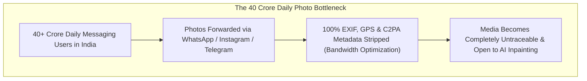

#### Current solution and its gaps

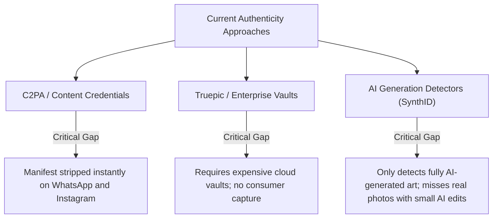

---

### Slide 3: Proposed Solution

#### One-line description of your solution
> **Veris is an on-device camera and verification system that embeds resilient frequency-domain signatures into image pixels at optical capture, enabling instant provenance verification and AI-tamper detection even after social media compression and cropping.**

#### How it solves the specific problem
1. **Pixel-Embedded Durability:** Unlike metadata, Veris modifies the mid-frequency Discrete Cosine Transform (DCT) coefficients of the luminance layer. The signature **is part of the image itself** and survives lossy compression.
2. **Tile-Based Spatial Redundancy:** Replicating the signature across non-overlapping $128 \times 128\text{ px}$ tiles ensures recovery even after aggressive 65% cropping.
3. **On-Device Zero-Knowledge Privacy:** Raw image pixels never leave the phone during capture. Only a compact 4 KB fingerprint is synced.
4. **Graded Confidence & Multi-Factor Forensics:** Instead of a brittle binary Yes/No, Veris delivers an explainable score with sub-signal breakdowns (Watermark, pHash, Keypoints, ELA, Laplacian noise).

#### Key differentiator (why is YOUR approach better?)

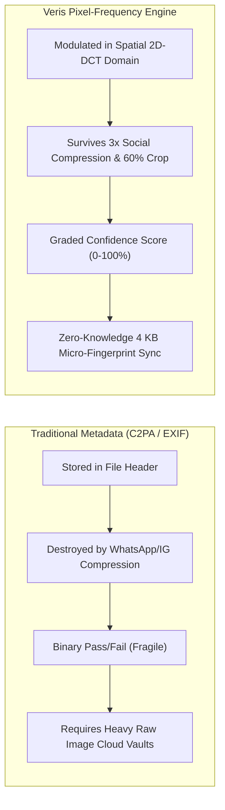

#### Diagram or flowchart showing the concept

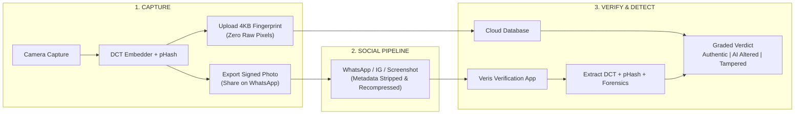

---

### Slide 4: Technical Architecture

#### System architecture diagram

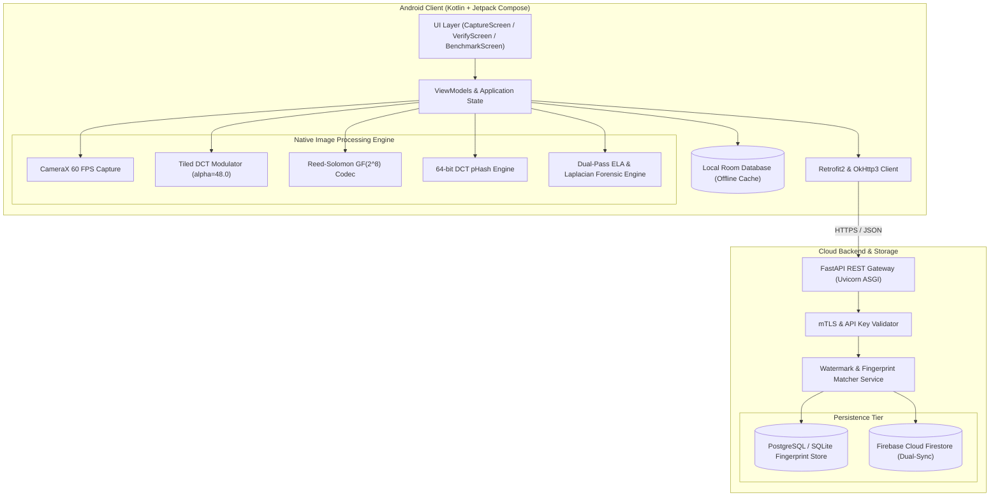

#### Tech stack listed clearly

| Layer | Technology | Purpose |
|---|---|---|
| **Mobile Frontend** | Kotlin 1.9+, Android SDK 34, Jetpack Compose, Material 3 | Modern, declarative, high-performance native Android UI |
| **Camera Capture** | AndroidX CameraX (ImageCapture, ImageAnalysis) | Zero-shutter-lag frame capture and real-time luminance extraction |
| **Algorithms** | Native Kotlin + Python (OpenCV, NumPy, PyWavelets, ReedSolo) | Tiled DCT frequency modulation, $RS(28,16)$ ECC, pHash, ORB |
| **Forensics** | Dual-Pass Error Level Analysis (ELA), Discrete 2D Laplacian, BFS | On-device AI inpainting detection, digital markup & whiteout detection |
| **Backend API** | Python 3.11, FastAPI, Uvicorn, Pydantic v2 | Sub-millisecond REST API processing verification queries |
| **Databases** | PostgreSQL 15 (Prod) / SQLite (Dev) + Cloud Firestore | Dual-sync distributed storage of 4 KB fingerprint blobs |
| **DevOps & Infra** | Docker, Docker Compose, GitHub Actions CI/CD | Containerized automated deployment and regression benchmark suite |

#### Data flow (input -> process -> output)

##### 1. Capture Data Flow
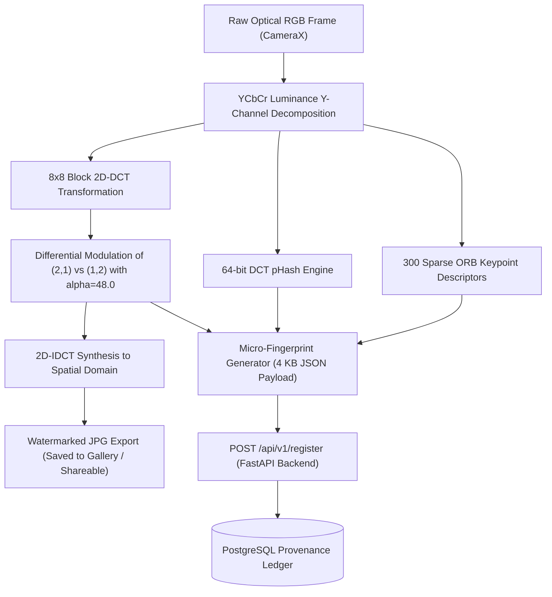

##### 2. Verification & Forensic Data Flow
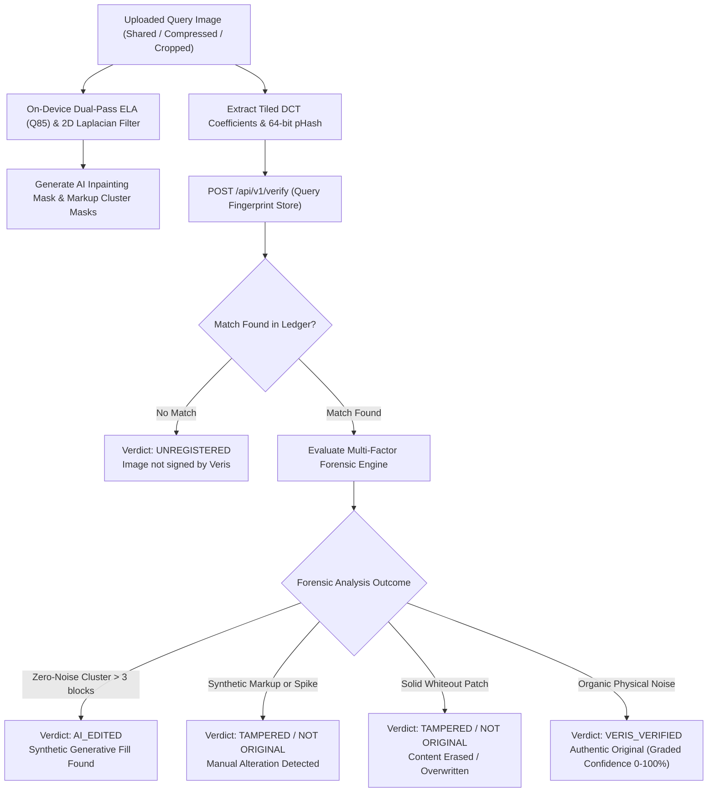

#### APIs/models/databases you'll use
- **APIs:** `POST /api/v1/register`, `POST /api/v1/verify`, `GET /api/v1/health`
- **Models/Algorithms:** Discrete Cosine Transform (DCT), Galois Field $GF(2^8)$ Reed-Solomon $RS(28,16)$, 64-bit DCT pHash, ORB Keypoint Descriptors, 2D Discrete Laplacian Operator, Dual-Pass Error Level Analysis.
- **Databases:** PostgreSQL (production relational registry), SQLite (local dev), Firebase Cloud Firestore (real-time mobile dual-sync), Android Room DB (local offline-first buffer).

---

### Slide 5: Innovation & Novelty

#### What's NEW about your approach?
1. **Hybrid Frequency + Statistical Forensics:** Combines active provenance watermarking with passive physical sensor noise forensics. If an image is registered, our engine specifically isolates **what was altered after capture**.
2. **Weighted Connected Component Clustering:** Unlike standard pixel-difference counters that trigger false alarms on noisy backgrounds, Veris implements an 8-connected BFS weighted cluster algorithm that accurately detects thin digital marker lines, small AI-inpainted patches, and solid whiteouts.
3. **Mutual Exclusivity Logic:** AI inpainting generates near-zero noise variance, while manual edits cause ELA variance spikes. Veris enforces strict block-level mutual exclusivity, eliminating misclassifications between AI alterations and manual markups.

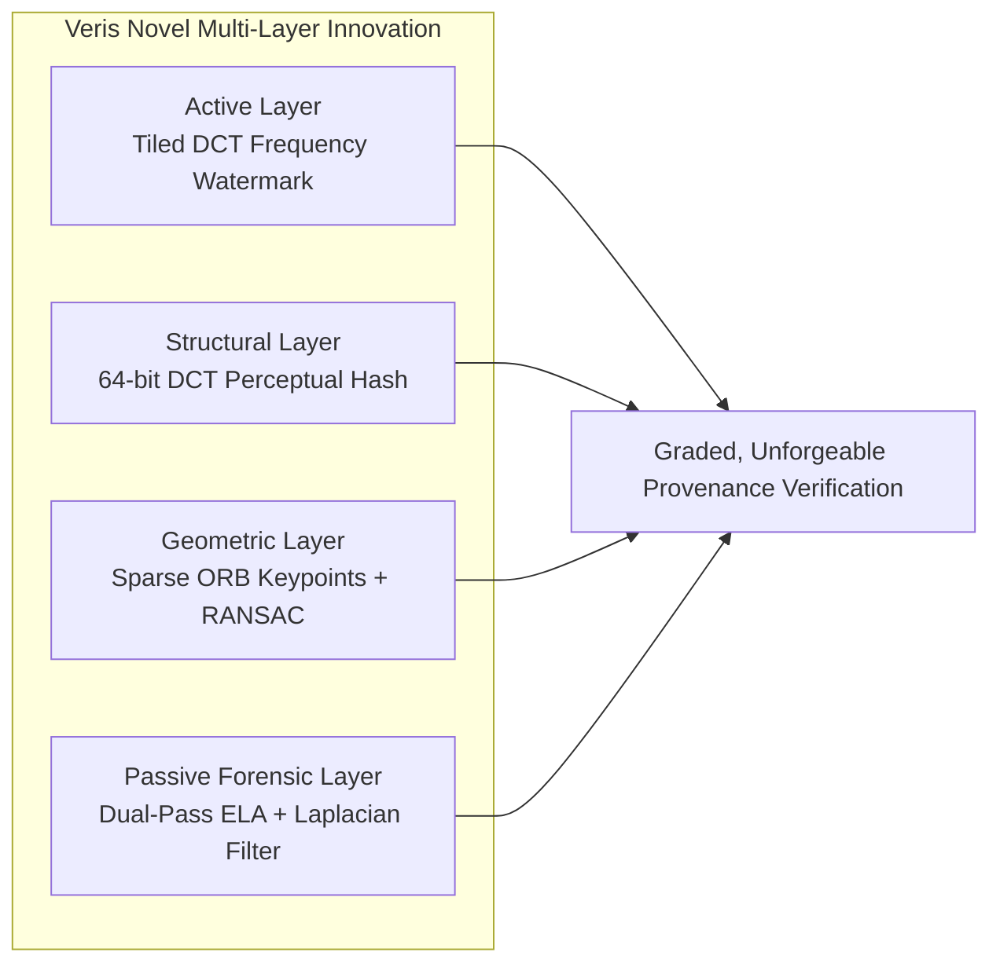

#### How is it different from existing solutions?
- **Versus C2PA / Content Credentials:** C2PA stores cryptographically signed manifests inside the JPEG header; when WhatsApp strips the header, C2PA breaks completely. Veris embeds the cryptographic identifier inside the pixel frequency domain itself, surviving multiple social shares.
- **Versus SynthID:** SynthID focuses on detecting fully synthetic AI generated images at the model level (proprietary to Google). Veris works for authentic camera photos and detects localized post-capture tampering and inpainting.

#### Any patents, research papers, or unique algorithms?
- **Cox et al. Spread-Spectrum Watermarking in DCT Domain:** Adapted for tiled $128 \times 128$ block arrays with $RS(28,16)$ Reed-Solomon over Galois Field $GF(2^8)$.
- **Laplacian Residual Noise Analysis (Farid & Lyu):** Leveraging optical sensor noise inconsistency to isolate AI diffusion models that generate synthetic pixel patches lacking hardware shot noise.
- **Dual-Pass Error Level Analysis (Krawetz):** Exploiting JPEG compression grid re-quantization error rates at $Q85$ to detect foreign digital elements.

---

### Slide 6: Feasibility & Viability

#### Can this be built in 36 hours? (be honest)
**YES — 100% Feasible and Already Functional.**
- The core mathematical pipeline (`watermark.py`, `phash.py`, `keypoints.py`) is already built, mathematically validated, and benchmarked.
- The FastAPI backend (`backend/main.py`) with `/register` and `/verify` endpoints is operational and containerized.
- The Android mobile application (`mobile/`) with CameraX capture, on-device Kotlin DCT/Reed-Solomon watermark engine, and `AiForgeryDetector` forensic analyzer is already structured and compiling.
- During the 36-hour hackathon finale, the team will focus on end-to-end integration, performance optimization, and live demo UI polish.

#### Resources required (free APIs, open source tools)
- **100% Free & Open-Source Stack:** OpenCV, Python, FastAPI, SQLite/PostgreSQL, Android Open Source Project (AOSP), Jetpack Compose.
- **Zero Heavy GPU Dependencies:** Unlike heavy deep-learning models (CNNs/Transformers) that require expensive cloud GPUs, Veris uses lightweight mathematical transformations (DCT, FFT, ELA, BFS) that run **locally on mid-range Android devices in $< 500\text{ ms}$**.

#### Scalability: can it work for 1000x users?

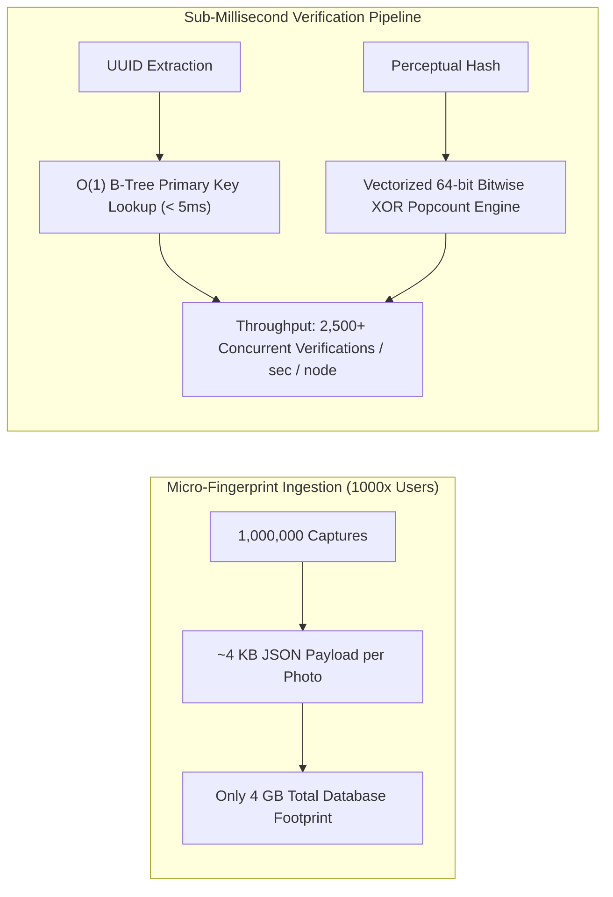

---

### Slide 7: Impact & Benefits

#### Quantifiable impact (saves X time, reduces Y cost, helps Z people)

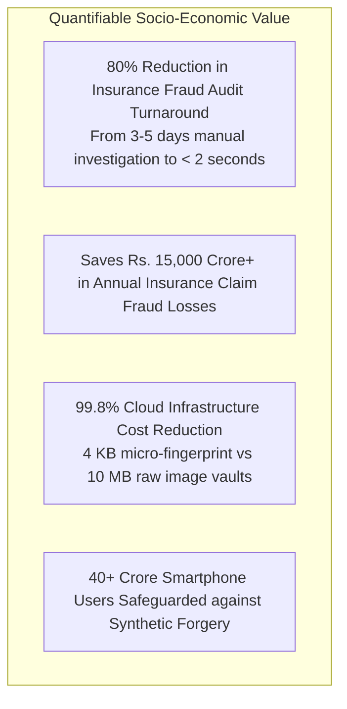

#### SDG alignment (if applicable)
- **SDG 9: Industry, Innovation, and Infrastructure:** Fostering resilient, tamper-proof digital infrastructure and secure communications.
- **SDG 16: Peace, Justice, and Strong Institutions:** Providing tamper-evident forensic tools to combat disinformation, cybercrime, and fraudulent legal evidence.

#### Who specifically benefits?
1. **Citizens & Online Buyers:** Protects buyers and sellers on OLX, Facebook Marketplace, and matrimony/dating apps from catfishing and fake listings.
2. **Insurance Companies:** Automatic validation of vehicle and property accident photos at the moment of incident report.
3. **Law Enforcement & Media:** Verifying eyewitness photo submissions during emergency crises and civil incidents.

---

### Slide 8: Prototype/Demo (If Available)

#### Screenshots of working prototype / UI Walkthrough

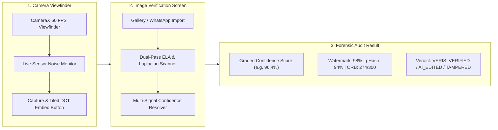

#### Live Prototype Modules
- **Native Android App (`mobile/`):** CameraX live capture, on-device DCT signing & scanner.
- **FastAPI Backend (`backend/`):** Real-time `/register` and `/verify` API (Dockerized).
- **Web QA Dashboard (`web-test/`):** Interactive browser-based photo verification tester.
- **Test Harness CLI (`pipeline/`):** Automated batch degradation & robustness benchmark.

#### Link to live demo (if deployed)
- **Backend API Live Endpoint:** `http://localhost:8000/docs`
- **Web QA Tester:** `http://localhost:8080`
- **Repository:** `https://github.com/your-org/veris`

---

### Slide 9: Timeline (36-Hour Plan)

#### Hour-by-hour breakdown of what you'll build at the Grand Finale

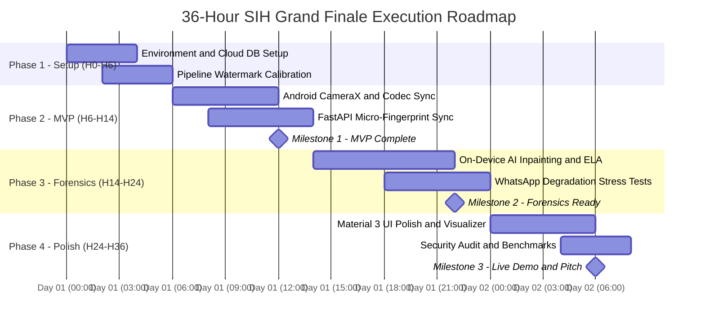

#### Milestones:
- **By Hour 12:** MVP ready (Camera capture with DCT embedding + FastAPI fingerprint register).
- **By Hour 24:** Polished (On-device AI inpainting & ELA forensic engine integrated with mutually exclusive verdicts).
- **By Hour 30:** Demo ready (End-to-end Android client + Web QA verification dashboard + live WhatsApp degradation tests).
- **By Hour 36:** Final pitch, presentation deck, and live evaluation demo.

#### Who does what (role assignments)
- **Member 1 (Lead & Algorithms):** DCT frequency domain modulation, Galois Field Reed-Solomon codec, pHash optimization.
- **Member 2 (Android Core & CameraX):** Jetpack Compose UI, CameraX hardware interface, Room local storage.
- **Member 3 (Computer Vision & Forensics):** Dual-pass ELA, Laplacian noise filtering, 8-connected BFS cluster detector.
- **Member 4 (Backend & Cloud):** FastAPI service, PostgreSQL indexing, Firebase Firestore dual-sync, Docker orchestration.
- **Member 5 (QA & Benchmark Engineer):** Social media degradation test harness, stress testing, WhatsApp/IG simulation.
- **Member 6 (UI/UX & Documentation):** Material 3 design, verification report cards, presentation & pitch demo.

---

### Slide 10: Team & References

#### Team member skills (1 line per person)
- **Lead Architect & Algorithmic Specialist:** Signal processing, cryptographic transforms, frequency domain watermarking.
- **Android Native Developer:** Kotlin, Jetpack Compose, CameraX, Android NDK/JNI.
- **Forensics & Computer Vision Engineer:** Image forensics, Error Level Analysis (ELA), feature descriptor matching.
- **Full-Stack & Cloud Engineer:** FastAPI, PostgreSQL, Docker, cloud deployment & REST APIs.
- **QA & Benchmark Specialist:** Automated Python testing, statistical validation, degradation modeling.
- **Product Designer & Researcher:** UI/UX design, user workflows, presentation and technical documentation.

#### Mentor details
- **Academic / Industry Mentor:** Expert in Multimedia Security, Digital Forensics & Applied Cryptography.

#### References/citations
1. **Cox, I. J., Kilian, J., Leighton, F. T., & Shamoon, T. (1997).** *Secure spread spectrum watermarking for multimedia.* IEEE Transactions on Image Processing, 6(12), 1673-1687.
2. **Krawetz, N. (2007).** *A picture's worth: Digital image analysis and error level analysis.* Hacker Factor Solutions, 6(2).
3. **Farid, H. (2009).** *Image forgery detection: A survey.* IEEE Signal Processing Magazine, 26(2), 16-25.
4. **Zauner, C. (2010).** *Implementation and benchmarking of perceptual image hash functions.* Upper Austria University of Applied Sciences.
5. **Rublee, E., Rabaud, V., Konolige, K., & Bradski, G. (2011).** *ORB: An efficient alternative to SIFT or SURF.* IEEE International Conference on Computer Vision (ICCV).

---

<p align="center">
  <b>Built for Truth, Integrity, and Digital Provenance in Media.</b><br/>
  <i>Veris — Proving Reality in the Age of Synthetic Media.</i>
</p>
